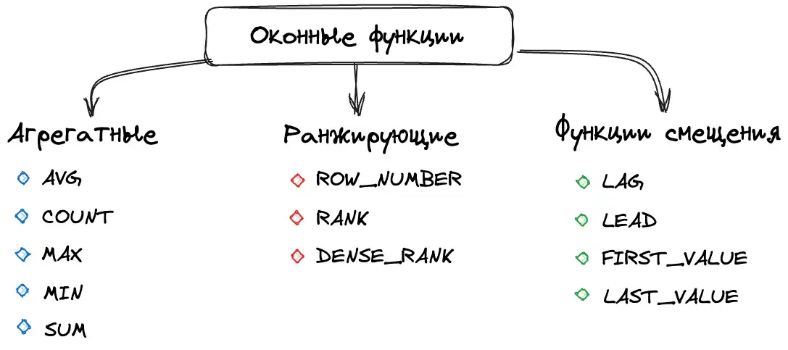
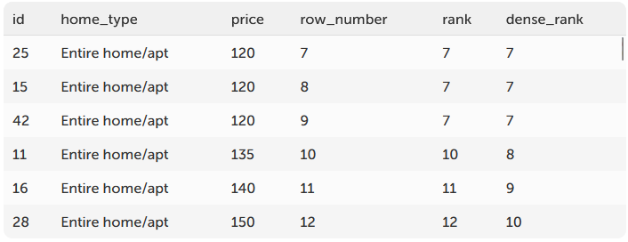

### Хранимые процедуры
Просто оставлю это здесь для напоминания что они существуют. По факту их использовать попа боль моя дырка задница, я пока не увидел ни одного хорошего примера их использования, который нельзя было бы вынести в обычный код. И это было бы гораздо удобнее. В общем, я еще не осознал всю силу этой стороны SQL

### Дополнительные математические функции

| Имя функции        | Описание                                                                                                                      |
|--------------------|-------------------------------------------------------------------------------------------------------------------------------|
| POW(num, power)    | Вычисляет число в указанной степени                                                                                           |
| SQRT(num)          | Вычисляет квадратный корень числа                                                                                             |
| LOG(base, num)     | Вычисляет логарифм числа по указанному основанию                                                                              |
| EXP(num)           | Вычисляет enum                                                                                                                |
| SIN(num)           | Вычисляет синус числа                                                                                                         |
| COS(num)           | Вычисляет косинус числа                                                                                                       |
| TAN(num)           | Вычисляет тангенс числа                                                                                                       |
| CEIL(num)          | Округление в большую сторону                                                                                                  |
| FLOOR(num)         | Округление в меньшую сторону                                                                                                  |
| ROUND(num)         | Математическое округление                                                                                                     |
| TRUNCATE(num,num2) | Отбрасывает до num2 знаков после запятой. При этом можно указывать отрицательное число, что занулит цифры справ перед запятой |
| SIGN (num)         | Вернет -1 если отрицательное, 0 если 0 и 1 если положительное                                                                 |
| ABS(num)           | Вернет модуль числа                                                                                                           |


### Функции работы с датой

Основные функции мне и так известны и перечислять я их не буду. А вот функция `TIMESTAMPDIFF`, которая в нужном формате отдает точное количество лет, месяцев или дней между 2 датами - очень интересна)
Синтаксис: `TIMESTAMPDIFF(YEAR, '2003-07-03 14:10:26', NOW());`. Вместо YEAR можно подставить MONTH, DAY, HOUR, MINUTE - получим очень точное значение

### CAST

Функция конвертации данных по типам. Я про нее знаю, но этот момент достаточно важный, чтобы его указать явно

Синтаксис: `SELECT CAST(12005.6 AS DECIMAL)`

Если скастовать тип невозможно - вернет NULL

| Тип              | Описание                                                                                                                                                                                         |
|------------------|--------------------------------------------------------------------------------------------------------------------------------------------------------------------------------------------------|
| DATE             | Конвертирует значение в DATE. Формат: "YYYY-MM-DD".                                                                                                                                              |
| DATETIME         | Конвертирует значение в DATETIME. Формат: "YYYY-MM-DD hh:mm:ss".                                                                                                                                 |
| TIME             | Конвертирует значение в TIME. Формат: "hh:mm:ss".                                                                                                                                                |
| DECIMAL[(M[,D])] | Конвертирует значение в DECIMAL. Имеет два необязательных аргумента M и D, определяющих максимальное количество знаков до и после запятой соответственно. По умолчанию, D равен 0, а M равен 10. |
| CHAR[(N)]        | Конвертирует значение в CHAR. В качестве необязательного аргумента можно передать максимальную длину строки.                                                                                     |
| SIGNED           | Конвертирует значение в значение BIGINT.                                                                                                                                                         |
| UNSIGNED         | Конвертирует значение в беззнаковое значение BIGINT.                                                                                                                                             |
| BINARY           | Конвертирует значение в BINARY.                                                                                                                                                                  |
| YEAR             | Конвертирует значение в год.                                                                                                                                                                     |

### Транзакции
Если у нас есть какая-то информация в БД, которую одновременно изменяют несколько пользователей или нужно последовательно выполнить несколько запросов для того чтобы ее успешно совершить - применяются транзакции. Транзакции сохраняют изменения данных временно в памяти БД, и только после специальной команды применяют их. Также транзакции блокируют некоторые строки(таблицы или блоки строк(страницы), зависит от настроек СУБД) на изменение, и остальные запросы должны дождаться освобождения данных до момента как они смогут быть выполнены

Синтаксис транзакций следующий:
```sql
START TRANSACTION;

-- Проверка наличия достаточного баланса у отправителя
SELECT @balance := user_balance FROM accounts WHERE user_id = 1;

-- Если средств недостаточно, отмена транзакции(забываем все изменения как будто никакого кода не выполняли)
IF @balance < 1000 THEN
ROLLBACK;
END IF;

-- Создаем точку сохранения перед изменением баланса первого пользователя
SAVEPOINT before_updating_user_1;
UPDATE accounts SET balance = balance + 100 WHERE user_id = 1;

-- Проверка условия для первого пользователя
-- например, проверяем логику бизнес-правил

-- Здесь мы предполагаем, что условие не выполнилось, и нам нужно отменить изменение баланса
ROLLBACK TO SAVEPOINT before_updating_user_1;

-- Обновляем баланс для второго пользователя
UPDATE accounts SET balance = balance + 200 WHERE user_id = 2;

-- Завершаем транзакцию, применив изменения
COMMIT;

```

Точки сохранения - это точка, которая начинает блок, который мы можем откатить. То есть если у нас между точкой сохранения и роллбэком к этой точке произошла ошибка, то мы откатываемся к точке сохранения, пропускаем блок с ошибкой и выполняем все что после роллбэка

### Оконные функции
Оконный функции - это такой инструмент, который по сути позволяет общаться к различным блокам данных в рамках одной таблицы. То есть вот сделали мы выборку, и над этой выборкой надо дополнительно провести операции ранжирования или агрегации - для этого можно использовать оконные функции

Оконные функции выполняются предпоследними, перед ORDER BY. То есть они работают над уже собранными данными

Пример когда можно использовать оконные функции - нам надо посчитать для таблицы апартаментов, насколько текущая цена отличается от средней по типу аппартаментов. То есть есть 3 типа апартаментов, в каждом типе по n записей. Для каждой записи есть текущая цена. Надо вывести разницу между средней ценой за все аппартаменты каждого типа и каждой конкретной записью

Синтаксис:
```sql
SELECT <оконная_функция>(<поле_таблицы>)
OVER (
      [PARTITION BY <столбцы_для_разделения>]
      [ORDER BY <столбцы_для_сортировки>]
      [ROWS|RANGE <определение_диапазона_строк>]
)
```

То есть мы говорим, что некоторая <оконная функция> над конкретным окном будет выполнена. Окно - это множество записей полученной таблицы, которые мы выбрали по какому-то правилу. 

Окна можно собирать с помощью 3 аргументов(они все не обязательны, если не указан ни один - берется вся таблица):

###### PARTITION BY
`PARTITION BY` - это функция разделения по **непересекающимся** множествам. В примере про апартаменты выше - это тип апартаментов. То есть всю таблицу мы разделили на 3 условные подтаблицы(партиции). В рамках каждой партиции мы будем выполнять операцию оконной функции и применять следующие аргументы, которые описаны ниже. Если партиция не указана - берется вся таблица и переходим дальше

###### ORDER BY

`ORDER BY` - это сортировка записей в рамках одной партиции. Это может быть полезно с использованием следующего аргумента. При этом по умолчанию если `ROWS`/`RANGE` не указан - то при использовании `ORDER BY` будут взяты все значения от начала до текущей записи(аналогично можно написать с помощью `RANGE BETWEEN UNBOUNDED PRECEDING AND CURRENT ROW`). 

Пример использования `ORDER BY` - нам надо для каждой даты посчитать общую выручку для каждого пользователя на момент этой даты. Для этого мы будем использовать следующий запрос:
```sql
SELECT user_id,
       start_date,
       total AS reservation_price,
       SUM(total) OVER (
           PARTITION BY user_id
           ORDER BY start_date
       ) AS cumulative_total
FROM Reservations;
```
В рамках этого запроса мы выбираем данные из таблицы(user_id, start_date, total) и к ним добавляем новую колонку с помощью оконной функции. В рамках этой оконной функции мы суммируем значения из партиции. Партиций у нас будет по количеству пользователей. В рамках каждой партиции мы сортируем записи по дате и для каждой записи пишем сумму price для всех предыдущих дат

###### ROWS/RANGE

`ROWS/RANGE` - это способ выборки конкретного диапазона значений или строк в рамках одной партиции. Этот диапазон называется окном. ROWS - строк, RANGE - значений. Не работает без ORDER BY. Возможные определения границ:

1. UNBOUNDED PRECEDING - все строки, предшествующие текущей
2. N PRECEDING - N строк до текущей строки
3. CURRENT ROW - текущая строка
4. N FOLLOWING - N строк после текущей строки
5. UNBOUNDED FOLLOWING - все последующие строки

Синтаксиc - `ROWS|RANGE BETWEEN <начало границы окна> AND <конец границы окна>`

`ROWS` берет физические строки как они есть. То есть ROWS 2 PRECEDING всегда берет 2 строки, которые расположены до текущей записи
`RANGE` берет значения строк, динамически формируя список внутри каждого окна. То есть RANGE 30 PRECEDING возьмет все записи, полученные через ORDER BY и вернет только такие, чье значение -30<= текущему значению строки( `x-30<=price<=x` )

###### Виды оконных функций



Есть 3 типа оконных функций - агрегатные, ранжирующие и функции смещения

1. Агрегатные - это функции, которые выполняют арифметическое вычисление и возвращает результат. В общем, обычные SUM, COUNT, AVG...
2. Ранжирующие - это функции, которые ранжируют значения. Они используются для того, чтобы поставить ранг для каждого значения - какой он по счету в общем списке этой партиции. Если значения повторяются, то ранг у них одинаковый
	1. При этом если значения повторяются, то следующий по счету ранг будет или с пропуском на количество повторений(`RANK`) или без пропусков (`DENSE_RANK`)
	2. Также есть команда ROW_NUMBER, которая просто выводит порядковый номер строки в окне
	3. Пример вывода -  То есть мы отсортировали значения, дали им порядковый номер. Если значения повторяются, то ранг у них одинаковый. После повторяющихся значений мы или перескакиваем на какой то ранг, или продолжаем счет
3. Смещение - это функции, которые позволяют перемещаться и обращаться к разным строкам в окне относительно текущей строки, а также обращаться к значениям в начле и конце
	1. `LAG` - обращается к значениям из предыдущих строк. Можно вытащить любое значение, а также указать смещение по кол-ву строк. Если значения нет - даст NULL или значение по умолчанию. Синтаксис: `LAG(столбец, смещение, значение по умолчанию)`
	2. `LEAD` - обращается к значению из последующих строк. В остальном дублирует `LAG`
	3. `FIRST_VALUE` - возвращает первое значение в окне. По сути как `LAG(столбец, количество строк до самого верха)`
	4. `LAST_VALUE` - возвращает последнее значение в окне. По сути как `LEAD(столбец, количество строк до самого низа)`

