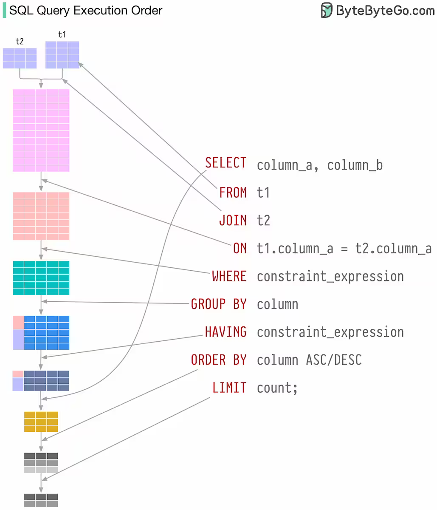

Здесь буду записывать конспект по SQL по новым для меня функциям и понятиям

Конкретно в этом разделе будет идти терминология

### Скалярный запросы

Это такие запросы, которые возвращают одну строку и одно значение. Зачастую встречаются в подзапросах. Пример: `SELECT * FROM FamilyMembers WHERE birthday = (SELECT MAX(birthday) FROM FamilyMembers);`. Здесь `(SELECT MAX(birthday) FROM FamilyMembers)` - это скалярный подзапрос

### Многостолбцовые запросы

Это такие запросы, которые возвращают несколько строк и несколько значений. С их помощью можно проводить сравнения как будто по составному ключу, то есть попарно сравнивать какие то параметры

Пример:
```sql
SELECT * FROM Reservations
    WHERE (room_id, price) IN (SELECT id, price FROM Rooms);
```
Здесь мы берем только такие Reservations, которые есть в таблице Rooms(то есть бронирования только по существующим комнатам). Можно было бы выбрать эти же данные с помощью JOIN, вот эквивалентная запись. Но как будто подзапросом будет быстрее по памяти, так как не будет создаваться временная таблица с данными из 2 конкатенированных таблиц
```sql
SELECT Reservations.* FROM Reservations
INNER JOIN Rooms
ON Reservations.room_id = Rooms.id
WHERE Reservations.price = Rooms.price;

```


### Коррелированные запросы
Вложенный запрос является коррелированным, если он использует данные из внешнего запроса. Пример:
```sql
SELECT SupplierName
FROM Suppliers
WHERE id IN 
--    Здесь начинается коррелированный запрос. Он использует в себе данные из внешнего запроса. По сути он берет каждую строку внешнего запроса и подставляет supplierID из нее в подзапрос    
      (SELECT id FROM Products 
              WHERE Products.SupplierID = Suppliers.supplierID AND Price < 20);
```

### Порядок выполнения SQL запроса

